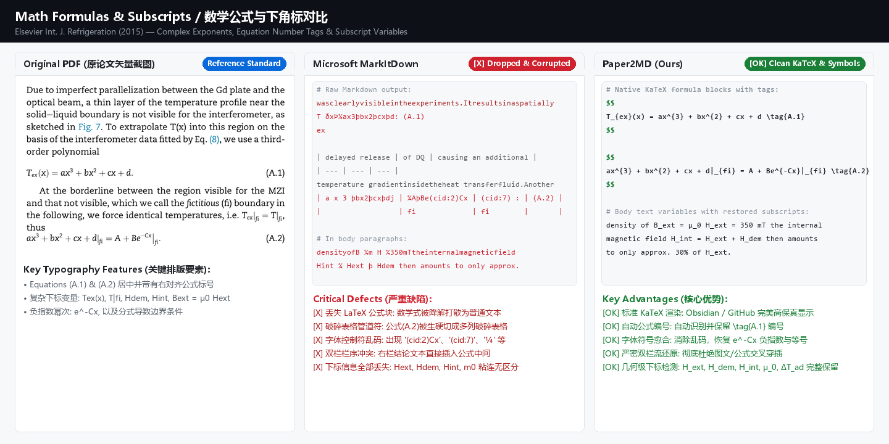
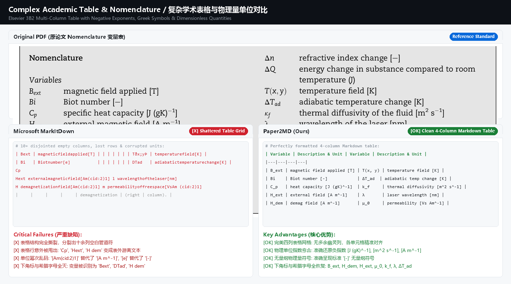
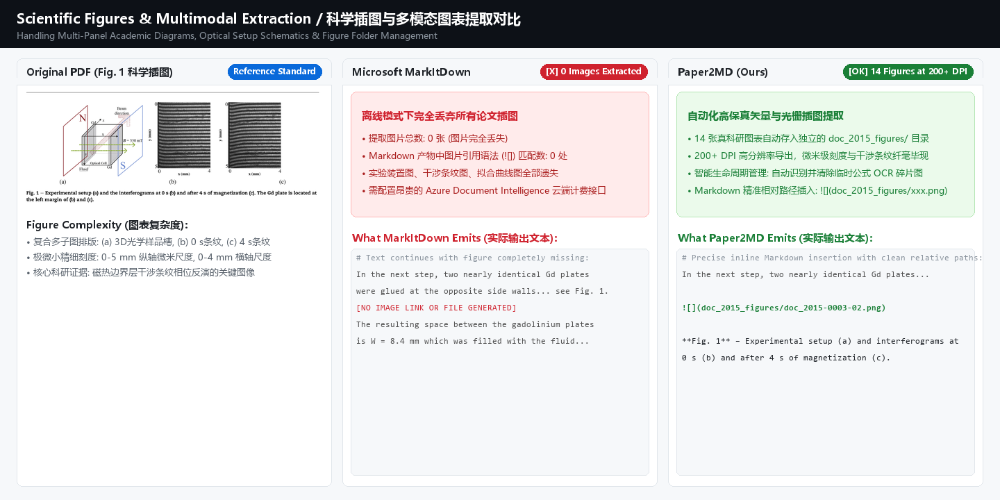

# Paper2MD 📄➡️📝

[](https://opensource.org/licenses/MIT)
[](https://www.python.org/downloads/)
[](https://github.com/xylu2024/paper2md)
[](https://github.com/pymupdf/pymupdf4llm)
[](https://github.com/RapidAI/RapidLaTeXOCR)

> **High-Fidelity Academic PDF to Markdown Converter**  
> Engineered specifically for complex scientific literature (dual-column layouts, vector schematics, high-resolution plots, and dense mathematical formulas).

---

## 💡 Motivation: Why Paper2MD?

Converting complex scientific papers (e.g., from *Nature Portfolio*, *ACS*, *Science*, *IEEE*, *Elsevier*) into Markdown for note-taking in **Obsidian**, LLM knowledge indexing (RAG), or web viewing is notoriously difficult:

- **Microsoft MarkItDown**: Relies on basic heuristic rules. On dual-column academic PDFs, it misinterprets columns and margins as a **monstrous 20-column empty table header**, glues words together (`determinethecompletereaction...`), completely drops figures in offline mode, and scrambles formulas into ASCII gibberish.
- **Raw PyMuPDF / Text Extractors**: While resolving reading flows, they slice mathematical equations into dozens of tiny PNG images that clutter your image folder and cannot be rendered natively as text.
- **Heavy Multimodal Models (e.g., Nougat / MinerU)**: While accurate, they require tens of gigabytes of GPU VRAM, heavy CUDA toolchains, and minutes per paper, making them impractical for lightweight laptops or quick batch workflows.

**Paper2MD** bridges this gap:
1. **Two-Column Flow Restoration**: Powered by PyMuPDF layout analysis, eliminating column splitting and word gluing.
2. **Local LaTeX Formula Recognition**: Automatically detects equation bounding boxes, passes them to a lightweight local ONNX model (**RapidLaTeXOCR**, ~0.3 s per equation), and outputs native KaTeX/MathJax `$$ ... $$` code with `\tag{}` equation numbers.
3. **Clean Figure Management**: Extracts only authentic scientific figures and diagrams at high resolution (200+ DPI), while **automatically purging temporary equation snippet images** to keep your folder tidy.
4. **Font & Symbol Healing**: Eliminates replacement character artifacts (``), automatically restores negative unit exponents (e.g., `[J (gK)⁻¹]`, `W m⁻²`), dimensionless markers `[-]`, vector arrow symbols (`$\vec{B}$`, `$\vec{f}_L$`), and multilingual author accents (`Tušek`, `Poredoš`, `Universität`).
5. **Blazingly Fast & Lightweight**: Converts a 10-page dense article in 5–10 seconds on a standard CPU.

---

### 🔬 Head-to-Head Comparison: MarkItDown vs. Paper2MD

To demonstrate the real-world conversion quality on dense academic literature, we benchmarked **Microsoft MarkItDown** against **Paper2MD** using peer-reviewed papers from Elsevier (*International Journal of Refrigeration*, 2015) and ACS (*Journal of Physical Chemistry C*, 2026).

---

### 1. Math Formulas & Subscripts (数学公式、符号与下角标)
*Tested on Elsevier Int. J. Refrigeration (2015) — Complex Exponents, Diacritics & Equation Bounding Boxes*



* **Microsoft MarkItDown**:
  - **Equations dropped**: Mathematical equations are stripped of LaTeX structure, mangled into plain text, or sliced into fragmented Markdown table pipes (e.g. `| a x 3 þbx2þcxþdj | ¼AþBe(cid:2)Cx | (cid:7) : | (A.2) |`).
  - **Subscripts wiped**: Because underlying text extractors lack baseline awareness, subscripts are merged directly into base letters (`Hext`, `Hdem`, `Hint`, `m0`).
  - **Corrupted control bytes**: Elsevier 3B2 custom font encodings decay into `(cid:2)Cx`, `(cid:7)`, and `¼` instead of `=`.
  - **Column collisions**: Two-column reading order fails, scrambling conclusion paragraphs directly across the equations.

* **Paper2MD (Ours)**:
  - **Native KaTeX Blocks**: Automatically detects equation bounding boxes and converts them via RapidLaTeXOCR into standard `$$ ... $$` math blocks.
  - **Automatic Equation Tagging**: Accurately recognizes and preserves equation labels like `\tag{A.1}` and `\tag{A.2}`.
  - **Geometry-Aware Subscript Detection**: Analyzes font size ratios and vertical baseline displacement ($\Delta y$), cleanly recovering variable subscripts (`H_{ext}`, `H_{dem}`, `H_{int}`, `\mu_0`, `\Delta T_{ad}`).
  - **Full Font Healing**: Restores mathematical equality (`=`), signs (`+`, `-`), and exponential decay (`e^{-Cx}`).

```markdown
$$
T_{ex}(x) = ax^{3} + bx^{2} + cx + d \tag{A.1}
$$

$$
ax^{3} + bx^{2} + cx + d|_{fi} = A + Be^{-Cx}|_{fi} \tag{A.2}
$$
```

---

### 2. Complex Academic Tables & Units (复杂学术表格与物理量单位)
*Tested on Elsevier 3B2 Multi-Column Nomenclature Table with Negative Exponents & Greek Symbols*



* **Microsoft MarkItDown**:
  - **Shattered Grid**: Misidentifies whitespace as dozens of empty phantom columns (`| | | | | | |`).
  - **Dropped Rows**: Critical rows (`Cp`, `Hext`, `H dem`) are ejected outside the table as disjointed text.
  - **Corrupted Unit Exponents**: Negative exponents turn into control bytes `[Am(cid:2)1]`, and dimensionless quantities become raw placeholders `[e]`.

* **Paper2MD (Ours)**:
  - **Clean 4-Column Grid**: Exact grid alignment without phantom columns or missing rows.
  - **Unit Exponent Healing**: Accurately reconstructs negative unit powers: `[J (gK)⁻¹]`, `[m² s⁻¹]`, `[A m⁻¹]`, `[Vs Am⁻¹]`.
  - **Standard Dimensionless Quantities**: Restores standard dimensionless indicators `[-]`.
  - **Intact Variable Subscripts & Greek Symbols**: Perfectly renders `B_{ext}`, `C_p`, `H_{ext}`, `H_{dem}`, `k_f`, `\mu_0`, `\lambda`, and `\Delta T_{ad}`.

---

### 3. Scientific Figures & Multimodal Extraction (科学插图与多模态图表提取)
*Tested on Multi-Panel Academic Diagrams & Interferometric Optical Setups*



* **Microsoft MarkItDown**:
  - **0 Figures Extracted**: Offline conversion completely ignores all graphics, schematics, and plots. Output Markdown contains zero `![]` tags.
  - **Evidence Loss**: Critical scientific evidence (3D setup diagrams, interferogram fringes, calibration curves) is silently lost unless tied to expensive cloud API endpoints.

* **Paper2MD (Ours)**:
  - **14 Figures Auto-Extracted**: All authentic figures extracted at high resolution (200+ DPI) into structured folders (`doc_2015_figures/`).
  - **Seamless Markdown Embedding**: Automatically inserted into Markdown with clean relative paths (``).
  - **Smart Cleanup**: Automatically purges temporary formula OCR snippets so your figures directory stays clean and clutter-free.

---

### 4. Dual-Column Layout & Headings
*Tested on ACS JPCC (Bidmon et al., 2026)*

* **Microsoft MarkItDown Output**:
  ```markdown
  | | pubs.acs.org/JPCC | | | | | | | | | | | | | | | Article |
  | --- | --- | --- | --- | --- | --- | --- | --- | --- | --- | --- | --- | --- | --- | --- | --- | --- |
  | | Determination | | | | of the | Kinetic | | Rate | Law | of | Rare-Earth | | | Solvent | | |
  | | Extraction | | Using | | Interferometry: | | | | The | Case | of | Samarium(III) | | | | |
  | .selcitra dehsilbup erahs yletamitigel ot woh no snoitpo rof senilediuggnirahs/gro.sca.sbup//:sptth eeS | ABSTRACT: | The | growing | | demand | for rare-earths, | | which are | | | | | | | | |
  ```
  *(Result: Inexplicably converted into a huge broken table where body text only occupies the table header, and watermark text is reversed).*

* **Paper2MD Output**:
  ```markdown
  # Determination of the Kinetic Rate Law of Rare-Earth Solvent Extraction Using Interferometry: The Case of Samarium(III)

  **Alexander Bidmon, Kilian Ortmann, Yuheng He, Kerstin Eckert, and Zhe Lei\***

  *Cite This: J. Phys. Chem. C 2026, 130, 1148−1157*

  ### ABSTRACT
  The growing demand for rare-earths, which are processed by using costly and environmentally unfriendly solvent extraction methods, requires a better understanding of the underlying reaction kinetics...
  ```
  *(Result: Clean hierarchy, clear headers, and natural reading flow).*

---

### 5. Summary Matrix

| Feature | Microsoft MarkItDown | PyMuPDF4LLM (Raw) | **Paper2MD (v0.1.2)** |
| :--- | :--- | :--- | :--- |
| **Dual-Column Reading Flow** | ❌ Broken into giant empty tables | ✅ Natural reading flow | ✅ **Natural reading flow** |
| **Figure Extraction** | ❌ 0 figures offline (needs Azure API) | ⚠️ Mixed formulas & figures | ✅ **Authentic figures only (200+ DPI)** |
| **Formula Recognition** | ❌ Lost or mangled into plain text | ⚠️ Cluttered with PNG image snippets | ✅ **Native KaTeX `$$...$$` with `\tag{}`** |
| **Subscripts & Greek Letters** | ❌ Erased (`Hext`, `Bext`, `m0`) | ❌ Ignored by layout engine | ✅ **Geometry-aware subscript detection (`H_{ext}`, `\mu_0`)** |
| **Table Formatting & Units** | ❌ Shattered grid, `[Am(cid:2)1]` | ⚠️ Raw unhealed font codes | ✅ **Clean 4-column tables & `[J (gK)⁻¹]`, `[-]`** |
| **Font & Symbol Healing** | ❌ Replacement chars (``) | ❌ Raw unmapped glyphs | ✅ **Automated CMap translation & zero ``** |
| **Obsidian / Typora Native Math**| ❌ Cannot render | ⚠️ Cluttered with PNG links | ✅ **100% native vector math rendering** |
| **Footnotes & References** | ❌ Scrambled | ✅ Superscript (`<sup>1</sup>`) | ✅ **Superscript (`<sup>1</sup>`)** |
| **Hardware Overhead** | Lightweight (poor output) | Lightweight (~2s) | **Lightweight (~5-10s, 100% CPU offline)** |

---

## 📦 Installation

Paper2MD supports **Windows**, **Linux (Arch Linux / EndeavourOS, Ubuntu / Debian)**, and **macOS**.

### Option A: Install via `pipx` (Recommended for all platforms)

[`pipx`](https://pypa.github.io/pipx/) isolates the package and automatically exposes the `paper2md` command globally without polluting your system Python environment. This is especially ideal for **Arch Linux / EndeavourOS** (avoids PEP 668 `externally-managed-environment` errors):

#### 1. Install pipx (if not already installed)
* **Arch Linux / EndeavourOS**:
  ```bash
  sudo pacman -S python-pipx
  pipx ensurepath
  ```
* **Ubuntu / Debian**:
  ```bash
  sudo apt update && sudo apt install pipx
  pipx ensurepath
  ```
* **macOS (Homebrew)**:
  ```bash
  brew install pipx
  pipx ensurepath
  ```
* **Windows**:
  ```powershell
  pip install pipx
  pipx ensurepath
  ```
*(Restart your terminal after running `pipx ensurepath`)*

#### 2. Install Paper2MD globally
```bash
pipx install git+https://github.com/xylu2024/paper2md.git
```
`paper2md` is now globally available in any terminal!

---

### Option B: Standard `pip` Installation

You can install Paper2MD directly into your active Python virtual environment:

```bash
# Direct install from GitHub
pip install git+https://github.com/xylu2024/paper2md.git

# Or clone and install in editable mode for development
git clone https://github.com/xylu2024/paper2md.git
cd paper2md
pip install -e .
```

> **Arch Linux / EndeavourOS Tip**:  
> If running `pip install` on system Python throws `error: externally-managed-environment`, create a dedicated venv first:  
> `python -m venv ~/.local/share/paper2md-env && source ~/.local/share/paper2md-env/bin/activate`

---

## 🚀 CLI Usage

### Basic Commands

```bash
# 1. Convert a single paper (creates paper.md and a clean figures folder)
paper2md "path/to/paper.pdf"

# 2. Batch convert all PDF papers in the current directory
paper2md .

# 3. Batch convert all PDF papers in a target directory
paper2md "D:/PhD/Literature"

# 4. Custom figure DPI resolution (default: 200, use 300 for high-res publication figures)
paper2md "paper.pdf" --dpi 300

# 5. Fast mode: Skip formula OCR (keeps equations as images)
paper2md "paper.pdf" --no-ocr
```

---

## 🐍 Python API Usage

You can seamlessly integrate Paper2MD into your own research scripts or document ingestion pipelines:

```python
from paper2md import convert_pdf_to_md

# Convert PDF and get path of resulting markdown file
output_path = convert_pdf_to_md(
    pdf_path="path/to/article.pdf",
    output_md_path="output.md",      # Optional: defaults to same name
    dpi=200,                         # Optional: figure resolution
    enable_formula_ocr=True          # Optional: whether to run LaTeX OCR
)

print(f"Successfully converted to: {output_path}")
```

---

## 📂 Output Folder Structure

When processing `Bidmon_2026.pdf`, Paper2MD generates:

```text
Literature/
├── Bidmon_2026.pdf
├── Bidmon_2026.md                    <-- Clean Markdown with LaTeX equations
└── Bidmon_2026_figures/              <-- Only genuine figures & charts
    ├── Bidmon_2026.pdf-0004-03.png   <-- Figure 1
    ├── Bidmon_2026.pdf-0005-05.png   <-- Figure 2
    └── ...
```
*(All temporary formula image slices are automatically deleted after OCR recognition to ensure zero folder pollution).*

---

## 🛠️ Core Dependencies

- **[PyMuPDF](https://github.com/pymupdf/PyMuPDF)** & **[PyMuPDF4LLM](https://github.com/pymupdf/pymupdf4llm)**: State-of-the-art document layout parser and reading-flow deconstruction.
- **[RapidLaTeXOCR](https://github.com/RapidAI/RapidLaTeXOCR)**: Lightweight, high-accuracy offline LaTeX equation OCR based on ONNXRuntime.
- **`opencv-python-headless`**: Fast image preprocessing backend without desktop GUI dependencies, fully compatible with headless Linux environments.

---

## 📄 License

This project is licensed under the [MIT License](LICENSE).

---

## ✍️ Authors & Institutional Affiliation

**Dipl.-Ing. Xueyong Lu** (he/him)  
Doctoral Researcher / Research Associate  
Department: Fluid Dynamics of Resource Technology Processes  
Institute of Fluid Dynamics  
Helmholtz-Zentrum Dresden - Rossendorf (HZDR)  
